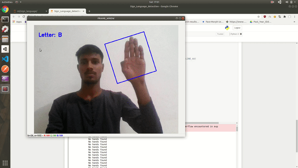

# Sign Language detection
Using this repository you can detect sign language letters from live video.

## What is [sign language](https://en.wikipedia.org/wiki/Sign_language)?
Sign languages are languages that use the visual-manual modality to convey meaning.
Sign languages are expressed through manual articulations in combination with non-manual elements.
Sign languages are full-fledged natural languages with their own grammar and lexicon.
It is used by deaf and dumb people.

#Demo

